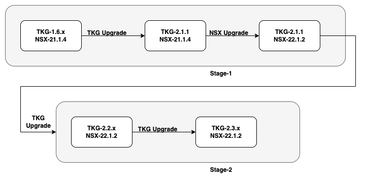

# Upgrade TKG Cluster from 1.6.x to 2.3.x

## Upgrade Path

### Process to Upgrade TKG Cluster

### Update Tanzu CLI

- [ ] Install the required version of Tanzu CLI.
  - [ ] Delete the `~/.config/tanzu/tkg/compatibility/tkg-compatibility.yaml` file.
  - [ ] Update the Carvel Tools
- [ ] Download supported OVA Image templates and Import them to Vsphere.
  - [ ] Download supported Kubernetes OVA files and import them to Vsphere.

### Upgrade Management Cluster

- [ ] Upgrade Tanzu management cluster to the latest supported version.
- [ ] Confirm the upgrade was successful.

[Known Issues]([https://](https://docs.vmware.com/en/VMware-Tanzu-Kubernetes-Grid/2.1/tkg-deploy-mc/mgmt-release-notes.html#known-issues-upgrade))

### Upgrade Workload Clusters

- [ ] List all supported tkr versions.
Upgrade the workload cluster to the latest Kubernetes version that is supported.
- [ ] Test all the components to see if the services are working as expected.

Repeat the same process for upgrading from `2.1.x` to `2.2.x` and then to `2.3.x`

[Please refer here for the runbook.] (./Runbook.md)

**Reference:**

<https://docs.vmware.com/en/VMware-Tanzu-Kubernetes-Grid/2.1/tkg-deploy-mc/mgmt-upgrade-index.html>
