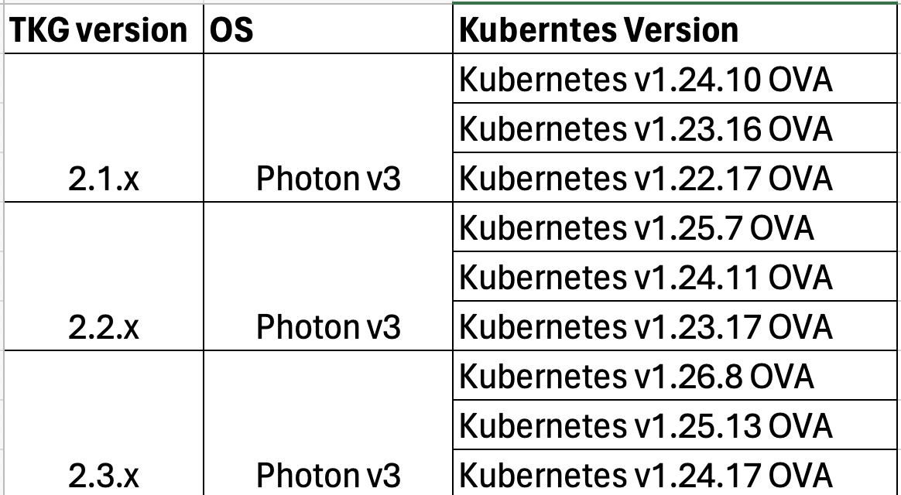

# Runbook for upgrading Tanzu Management and Workload Cluster

- [Runbook for upgrading Tanzu Management and Workload Cluster](#runbook-for-upgrading-tanzu-management-and-workload-cluster)
  - [Install/Update Tanzu CLI](#installupdate-tanzu-cli)
    - [Install the required version of Tanzu CLI](#install-the-required-version-of-tanzu-cli)
      - [Initialise the Tanzu CLI](#initialise-the-tanzu-cli)
    - [Update the Carvel Tools and kubectl](#update-the-carvel-tools-and-kubectl)
    - [Download Supported OVA Image templates](#download-supported-ova-image-templates)
  - [Upgrade Management Cluster](#upgrade-management-cluster)
  - [Upgrade Workload Clusters](#upgrade-workload-clusters)

## Install/Update Tanzu CLI

### Install the required version of Tanzu CLI

**Step-1**

Delete the `~/.config/tanzu/tkg/compatibility/tkg-compatibility.yaml` file.

**Step-2**

1. Go to VMware Customer Connect and log in with your VMware Customer Connect credentials.
2. Visit the Tanzu Kubernetes Grid downloads page.
3. In the VMware Tanzu Kubernetes Grid row, click Go to Downloads.
4. In the Select Version drop-down, select `2.1.1`.
5. Under Product Downloads, scroll to the section labelled VMware Tanzu CLI `2.1.1`.

```
Locate VMware Tanzu CLI for Linux and click Download Now.
```

Create a folder called `tanzu` , In the `tanzu` folder, unpack the Tanzu CLI bundle file for your operating system. To unpack the bundle file, use the extraction tool of your choice. You can use the `tar` command.

```bash
tar -xvf tanzu-cli-bundle-linux-amd64.tar.gz
cli/
cli/core/
cli/core/v0.28.1/
cli/core/v0.28.1/tanzu-core-linux_amd64
cli/tanzu-framework-plugins-standalone-linux-amd64.tar.gz
cli/tanzu-framework-plugins-context-linux-amd64.tar.gz
cli/ytt-linux-amd64-v0.43.1+vmware.1.gz
cli/kapp-linux-amd64-v0.53.2+vmware.1.gz
cli/imgpkg-linux-amd64-v0.31.1+vmware.1.gz
cli/kbld-linux-amd64-v0.35.1+vmware.1.gz
cli/vendir-linux-amd64-v0.30.1+vmware.1.gz


```

#### Initialise the Tanzu CLI

Navigate to the `cli` subfolder under the `tanzu` folder that you unpacked in the previous section.

```bash
ls
cli  tanzu-cli-bundle-linux-amd64.tar.gz
[vmadmin@relprdvjhorb01 2.1.1]$ cd cli/
[vmadmin@relprdvjhorb01 cli]$ ls
core                                    kbld-linux-amd64-v0.35.1+vmware.1.gz                   vendir-linux-amd64-v0.30.1+vmware.1.gz
imgpkg-linux-amd64-v0.31.1+vmware.1.gz  tanzu-framework-plugins-context-linux-amd64.tar.gz     ytt-linux-amd64-v0.43.1+vmware.1.gz
kapp-linux-amd64-v0.53.2+vmware.1.gz    tanzu-framework-plugins-standalone-linux-amd64.tar.gz

sudo install core/v0.28.1/tanzu-core-linux_amd64 /usr/local/bin/tanzu

echo $?
0
Output 0 means command ran successfully
```

**Initialise the Tanzu CLI:**


**Note:** Make sure you delete `~/.config/tanzu/tkg/compatibility/tkg-compatibility.yaml` file before running `init` command

```bash
tanzu init
ℹ  Checking for required plugins...
ℹ  Installing plugin 'kubernetes-release:v0.25.4' with target 'kubernetes'
ℹ  Installing plugin 'login:v0.28.1'
ℹ  Installing plugin 'pinniped-auth:v0.28.1'
ℹ  Installing plugin 'cluster:v0.25.4' with target 'kubernetes'
ℹ  Installing plugin 'feature:v0.25.4' with target 'kubernetes'
✖  [unable to find plugin 'isolated-cluster', unable to fetch the plugin metadata for plugin "login": could not find the artifact for version:v0.28.1, os:linux, arch:amd64, unable to fetch the plugin metadata for plugin "pinniped-auth": could not find the artifact for version:v0.28.1, os:linux, arch:amd64]
```

Check that the correct version of the CLI is properly installed.

```bash
tanzu version
version: v0.28.1
buildDate: 2023-03-07
sha: 0e6704777-dirty
```

Uninstall the existing plugins.

```bash
tanzu plugin clean
✔  successfully cleaned up all plugins
```

Install all the plugins for this release:

```bash
tanzu plugin sync
ℹ  Checking for required plugins...
ℹ  Installing plugin 'cluster:v0.25.4' with target 'kubernetes'
ℹ  Installing plugin 'feature:v0.25.4' with target 'kubernetes'
ℹ  Installing plugin 'login:v0.28.1'
ℹ  Installing plugin 'kubernetes-release:v0.25.4' with target 'kubernetes'
ℹ  Installing plugin 'management-cluster:v0.28.1'
ℹ  Installing plugin 'package:v0.28.1'
ℹ  Installing plugin 'pinniped-auth:v0.28.1'
ℹ  Installing plugin 'secret:v0.28.1'
ℹ  Installing plugin 'telemetry:v0.28.1'
✖  [unable to fetch the plugin metadata for plugin "login": could not find the artifact for version:v0.28.1, os:linux, arch:amd64, unable to find plugin 'isolated-cluster', unable to fetch the plugin metadata for plugin "management-cluster": could not find the artifact for version:v0.28.1, os:linux, arch:amd64, unable to fetch the plugin metadata for plugin "package": could not find the artifact for version:v0.28.1, os:linux, arch:amd64, unable to fetch the plugin metadata for plugin "pinniped-auth": could not find the artifact for version:v0.28.1, os:linux, arch:amd64, unable to fetch the plugin metadata for plugin "secret": could not find the artifact for version:v0.28.1, os:linux, arch:amd64, unable to fetch the plugin metadata for plugin "telemetry": could not find the artifact for version:v0.28.1, os:linux, arch:amd64]
```

Check plugin installation status and version:

```bash
tanzu plugin list

Standalone Plugins
  NAME                DESCRIPTION                                                        TARGET      DISCOVERY  VERSION  STATUS
  isolated-cluster    isolated-cluster operations                                                    default    v0.28.1  not installed
  login               Login to the platform                                                          default    v0.28.1  not installed
  pinniped-auth       Pinniped authentication operations (usually not directly invoked)              default    v0.28.1  not installed
  management-cluster  Kubernetes management-cluster operations                           kubernetes  default    v0.28.1  not installed
  package             Tanzu package management                                           kubernetes  default    v0.28.1  not installed
  secret              Tanzu secret management                                            kubernetes  default    v0.28.1  not installed
  telemetry           Configure cluster-wide telemetry settings                          kubernetes  default    v0.28.1  not installed

Plugins from Context:  nprod-tkg-management-cluster
  NAME                DESCRIPTION                           TARGET      VERSION  STATUS
  cluster             Kubernetes cluster operations         kubernetes  v0.25.4  installed
  feature             Operate on features and featuregates  kubernetes  v0.25.4  installed
  kubernetes-release  Kubernetes release operations         kubernetes  v0.25.4  installed
```

### Update the Carvel Tools and kubectl

Install the Kubernetes CLI

1. Go to VMware Customer Connect and log in with your VMware Customer Connect credentials.

2. Visit the Tanzu Kubernetes Grid downloads page.

3. In the VMware Tanzu Kubernetes Grid row, click Go to Downloads.

4. In the Select Version drop-down, select 2.1.1.

5. Under Product Downloads, scroll to the section labeled Kubectl 1.24.10 for VMware Tanzu Kubernetes Grid 2.1.1.

```
Locate kubectl cli v1.24.10 for Linux and click Download Now.
```

To unpack the bundle file, use the extraction tool of your choice. For example, the `gunzip` command.

```bash
gunzip kubectl-linux-v1.24.10+vmware.1.gz
chmod ugo+x kubectl-linux-v1.24.10+vmware.1
sudo install kubectl-linux-v1.24.10+vmware.1 /usr/local/bin/kubectl
kubectl version
WARNING: This version information is deprecated and will be replaced with the output from kubectl version --short.  Use --output=yaml|json to get the full version.
Client Version: version.Info{Major:"1", Minor:"24", GitVersion:"v1.24.10+vmware.1", GitCommit:"b980a736cbd2ac0c5f7ca793122fd4231f705889", GitTreeState:"clean", BuildDate:"2023-01-24T15:36:34Z", GoVersion:"go1.19.5", Compiler:"gc", Platform:"linux/amd64"}
Kustomize Version: v4.5.4
Server Version: version.Info{Major:"1", Minor:"23", GitVersion:"v1.23.10+vmware.1", GitCommit:"be027d20057c3efdd26b5325840b13394c1f6437", GitTreeState:"clean", BuildDate:"2022-08-30T05:47:03Z", GoVersion:"go1.17.13", Compiler:"gc", Platform:"linux/amd64"}
```

Tanzu Kubernetes Grid provides signed binaries for ytt, kapp, kbld, and imgpkg, that are bundled with the Tanzu CLI. The bundle also includes vendir, a Kubernetes directory structure tool, that is not currently required by end users, but is provided for convenience.

Go to cli folder.

```bash
cd cli
```

update ytt

```
ytt --version
ytt version 0.41.1
```

```bash
gunzip ytt-linux-amd64-v0.43.1+vmware.1.gz
chmod ugo+x ytt-linux-amd64-v0.43.1+vmware.1
sudo mv ./ytt-linux-amd64-v0.43.1+vmware.1 /usr/local/bin/ytt
ytt --version
ytt version 0.43.1
```

update kapp

```
kapp --version
kapp version 0.49.0

Succeeded
```

```bash
gunzip kapp-linux-amd64-v0.53.2+vmware.1.gz
chmod ugo+x kapp-linux-amd64-v0.53.2+vmware.1
sudo mv ./kapp-linux-amd64-v0.53.2+vmware.1 /usr/local/bin/kapp
kapp --version
kapp version 0.53.2

Succeeded
```

update kbld
```bash
kbld --version
kbld version 0.34.0

Succeeded
```

```bash
gunzip kbld-linux-amd64-v0.35.1+vmware.1.gz
chmod ugo+x kbld-linux-amd64-v0.35.1+vmware.1
sudo mv ./kbld-linux-amd64-v0.35.1+vmware.1 /usr/local/bin/kbld
kbld --version
kbld version 0.35.1

Succeeded
```

update imgpkg
```bash
```

```bash
gunzip imgpkg-linux-amd64-v0.31.1+vmware.1.gz
chmod ugo+x imgpkg-linux-amd64-v0.31.1+vmware.1
sudo mv ./imgpkg-linux-amd64-v0.31.1+vmware.1 /usr/local/bin/imgpkg
imgpkg --version
```

### Download Supported OVA Image templates

1. Go to the Tanzu Kubernetes Grid downloads page and log in with your VMware Customer Connect credentials.
2. Download the latest Tanzu Kubernetes Grid OVAs for the OS and Kubernetes version lines that your management and workload clusters are running.
3. In the vSphere Client, right-click an object in the vCenter Server inventory and select Deploy OVF template.
4. Select Local file, click the button to upload files, and navigate to a downloaded OVA file on your local machine.
5. Follow the installer prompts to deploy a VM from the OVA.
   1. Accept or modify the appliance name.
   2. Select the destination datacenter or folder.
   3. Select the destination host, cluster, or resource pool.
   4. Accept the end user license agreements (EULA).
   5. Select the disk format and destination datastore.
   6. Select the network for the VM to connect to.
   7. Click Finish to deploy the VM.
6. When the OVA deployment finishes, right-click the VM and select Template > Convert to Template.
7. In the VMs and Templates view, right-click the new template, select Add Permission, and assign your Tanzu Kubernetes Grid user, for example, tkg-user, to the template with the Tanzu Kubernetes Grid role, for
example, TKG. You created this user and role in Prepare to Deploy Management Clusters to vSphere.
Repeat the procedure for each of the Kubernetes versions for which you have downloaded the OVA file.



## Upgrade Management Cluster
To upgrade Tanzu Kubernetes Grid, you must upgrade all management clusters in your deployment. You cannot upgrade workload clusters until you have upgraded the management clusters that manage them.

## Upgrade Workload Clusters
